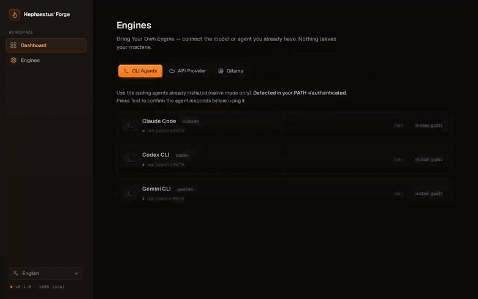

<div align="center">

# 🔥 Hephaestus' Forge

### Forja una idea difusa en una especificación lista para construir — con el motor de IA que ya tienes.

**Autoalojado · 100% local · Bring Your Own Engine**

[English](README.md) · [简体中文](README.zh.md) · [Español](README.es.md)

[](https://r10d1nsec.github.io/hephaestus-forge/)
[](https://github.com/r10d1nsec/hephaestus-forge)

[](LICENSE)
[](CONTRIBUTING.md)
[](https://github.com/r10d1nsec/hephaestus-forge/stargazers)


🌐 **[Web y demo](https://r10d1nsec.github.io/hephaestus-forge/)** · 📂 **[Ejemplos](examples/README.md)** · 🚀 **[Inicio rápido](#-inicio-rápido)** · 🤝 **[Contribuir](#-contribuir)**

<br/>

[](https://r10d1nsec.github.io/hephaestus-forge/)

<sub>De una idea en una frase → una entrevista de 5 fases → un **Project Blueprint** listo para construir. 100% local, con el motor de IA que ya tienes.</sub>

</div>

---

Deja de darle ideas a medio cocinar a tu agente de código. **Hephaestus' Forge** es una app web
autoalojada que te entrevista sobre tu idea y forja un pack de documentación completo —
**PRD, especificación técnica y una estimación de tiempo honesta**— lista para pegar en Claude Code,
Cursor, Codex o cualquier IDE con IA.

Y lo que nadie más hace: **funciona con la IA que ya tienes.**

## ✨ Por qué usarlo

- 🔒 **Privado por defecto**: 100% autoalojado. Tu idea y tus claves viven en local y **nunca salen de tu máquina**. Sin telemetría, sin cuenta SaaS.
- ⚡ **Bring Your Own Engine**: corre sobre los agentes que ya tienes (Claude Code, Codex, Gemini CLI) + Ollama + cualquier API. Cero lock-in.
- 🧭 **Elige la solución correcta**: antes de escribir una línea, te dice si conviene una automatización, un agente, una web o una app — no construyas una app para algo que resuelve un script.
- 💸 **Ahorra tokens y refactors**: una spec afilada antes = tu agente construye lo correcto a la primera.
- 🌍 **Multilingüe**: UI en EN · 中文 · ES · FR · DE, y el idioma elegido también controla las preguntas y los documentos.
- 🆓 **Open source (MIT)**: gratis para siempre. Extiéndelo, haz fork, lánzalo.

## ⚡ Bring Your Own Engine

El resto de herramientas de planificación te atan a una sola API key. Hephaestus funciona con lo que
tengas — incluidos los agentes de coding ya instalados en tu máquina:

| Motor | Ejemplos | Disponible en |
|---|---|---|
| 🖥️ **Agentes CLI** | `claude` (Claude Code), `codex`, `gemini` | Modo nativo |
| ☁️ **Providers API** | Anthropic, OpenAI, Google Gemini, compatibles con OpenAI (OpenRouter, Groq…) | Docker + Nativo |
| 🧊 **Modelos locales** | Ollama (Llama, Mistral, Qwen…) | Docker + Nativo |

La app **autodetecta** los agentes CLI de tu `PATH` y te deja configurar providers API/Ollama en un
panel **Engines** dedicado — prueba la conexión, elige el predeterminado y listo. Tus claves se
guardan solo en un SQLite local y **nunca salen del contenedor.**

## 🚀 Inicio rápido

### Opción A — Docker (motores API + Ollama)

```bash
git clone https://github.com/r10d1nsec/hephaestus-forge
cd hephaestus-forge
cp .env.example .env        # opcional — también puedes configurar motores en la UI
docker compose up -d
# abre http://localhost:3000
```

### Opción B — Modo nativo (desbloquea los agentes CLI 🔓)

```bash
git clone https://github.com/r10d1nsec/hephaestus-forge
cd hephaestus-forge
./run.sh
# abre http://localhost:3000
```

## 🛠️ Cómo funciona

1. **Describe** tu idea en una frase o un párrafo.
2. **Responde** una entrevista breve generada por IA — una pregunta afilada cada vez, en streaming —
   en cinco fases: **Discovery → Audiencia → Solución → Alcance → Restricciones**. Eso es lo que
   permite a Hephaestus recomendar el *tipo correcto* de solución en vez de asumir que necesitas una app.
3. **Genera** un pack liderado por un **Project Blueprint** (tipo de solución, escala, tiempo, etapas,
   alcance) + **PRD · Spec Técnica · Estimación**.
4. **Exporta** un ZIP de Markdown limpio, listo como contexto para tu agente de código.

> 🌍 Toda la app es multilingüe (EN · 中文 · ES · FR · DE); el idioma que elijas controla las preguntas y los documentos.

## 📂 Ejemplos reales

Tres packs **generados por el propio Hephaestus** con el engine de Claude Code:

- 🤖 [**Standup Forge**](examples/standup/) — git → standup diario (su [Blueprint](examples/standup/blueprint.md) recomienda una **automatización programada, no una web app**)
- 🇬🇧 [**Streakly**](examples/streakly/) — un habit tracker con IA
- 🇨🇳 [**聚单宝**](examples/dianxiaoer/) — mini-program de pedidos para restaurantes (en chino)

Ver [`examples/`](examples/README.md).

## 🤝 Contribuir

**Hephaestus se construye en abierto, y los contribuidores son lo que lo hace mejor.** Escribas
Rust o no hayas abierto nunca una terminal, hay una forma de entrar:

- ⭐ **Dale una star** — lo más fácil y lo que más ayuda a que llegue a más gente.
- 🖥️ **Añade un engine** — la contribución de mayor valor. Hay un taller *"tu primer engine en ~20 min"* en [CONTRIBUTING.md](CONTRIBUTING.md).
- 🌍 **Traduce** — añade un `README.<lang>.md` o un idioma de la UI.
- 📝 **Mejora los prompts** — el wizard y los generadores son Markdown en `backend/prompts/`, sin tocar código.
- 🐛 **Reporta un bug** o 💡 **propón una idea** — [abre un issue](https://github.com/r10d1nsec/hephaestus-forge/issues).

¿Nuevo por aquí? Mira los [`good first issue`](https://github.com/r10d1nsec/hephaestus-forge/labels/good%20first%20issue) — mantenemos una [lista semilla](docs/GOOD_FIRST_ISSUES.md). Sé amable; ver el [Código de Conducta](CODE_OF_CONDUCT.md).

> Cada star, issue y PR mueve esto hacia adelante de verdad. Gracias por forjar con nosotros. 🔥

## 📜 Licencia

[MIT](LICENSE) © 2026 Angel Roldan — Córdoba, España.

<div align="center">
<br/>

### Si Hephaestus te ahorró una refactorización, dale una ⭐

[](https://github.com/r10d1nsec/hephaestus-forge)
[](https://r10d1nsec.github.io/hephaestus-forge/)

</div>
