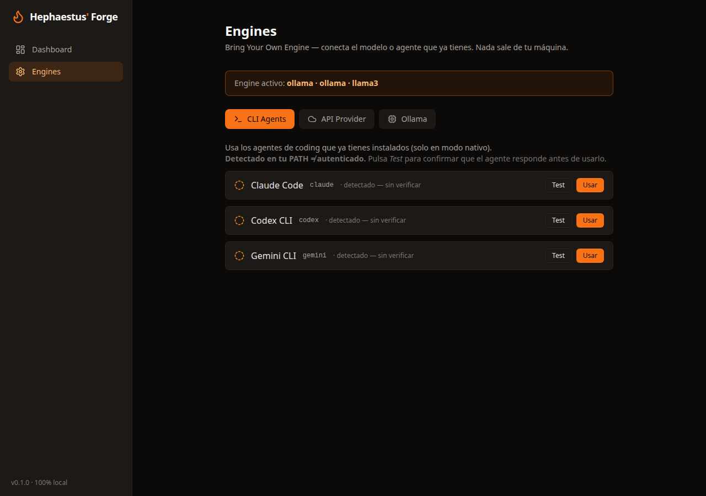

<div align="center">

# 🔥 Hephaestus' Forge

### Forge a vague idea into a build-ready spec — with the AI engine you already have.

**Self-hosted. 100% local. Bring Your Own Engine.**

[English](README.md) · [简体中文](README.zh.md) · [Español](README.es.md)

[](LICENSE)
[](CONTRIBUTING.md)


</div>

---

Stop feeding half-baked ideas to your coding agent. **Hephaestus' Forge** is a self-hosted web app
that interviews you about your idea, then forges a complete documentation pack — **PRD, technical
spec, and honest time estimation** — ready to drop into Claude Code, Cursor, Codex, or any AI IDE.

And the part nobody else does: **it runs on the AI you already have.**

## ⚡ Bring Your Own Engine

Every other planning tool locks you into one API key. Hephaestus runs on whatever you've got —
including the coding agents already installed on your machine:

| Engine | Examples | Works in |
|---|---|---|
| 🖥️ **CLI agents** | `claude` (Claude Code), `codex`, `gemini` | Native mode |
| ☁️ **API providers** | Anthropic, OpenAI, Google Gemini, OpenAI-compatible (OpenRouter, Groq, Together…) | Docker + Native |
| 🧊 **Local models** | Ollama (Llama, Mistral, Qwen…) | Docker + Native |

The app **auto-detects** the CLI agents in your `PATH` and lets you configure API/Ollama providers
in a dedicated **Engines** panel — test the connection, pick a default, done. Your keys are stored
only in a local SQLite file and **never leave the container.**

## 🚀 Quickstart

### Option A — Docker (API + Ollama engines)

```bash
git clone https://github.com/r10d1nsec/hephaestus-forge
cd hephaestus-forge
cp .env.example .env        # optional — you can also configure engines in the UI
docker compose up -d
# open http://localhost:3000
```

### Option B — Native mode (unlocks CLI agents 🔓)

Runs on the host so it can reach `claude` / `codex` / `gemini` in your `PATH`:

```bash
git clone https://github.com/r10d1nsec/hephaestus-forge
cd hephaestus-forge
./run.sh
# open http://localhost:3000
```

## 🛠️ How it works

```
Describe your idea  →  Guided wizard (Discovery → Scope → …)  →  Generate docs  →  Export ZIP
       💡                    🔥 your engine asks the right questions          📦 drop into your AI IDE
```

1. **Describe** your idea in a sentence or a paragraph.
2. **Answer** a short, AI-generated interview — one sharp question at a time, streamed live.
3. **Generate** a documentation pack: **PRD · Technical Spec · Estimation Report**.
4. **Export** as a ZIP of clean Markdown, ready as context for your coding agent.

## 📸 See it in action

| Bring Your Own Engine | Real generated PRD |
|---|---|
|  |  |

The **Engines** panel auto-detects CLI agents and is honest about it: *detected in PATH ≠
authenticated* — you click **Test** to verify before using. The viewer renders real, build-ready
Markdown.

## 📂 Examples (real output)

Two complete packs **generated by Hephaestus itself** with the Claude Code engine — from one
sentence to PRD + Tech Spec + Estimation:

- 🇬🇧 [**Streakly**](examples/streakly/) — an AI habit tracker → [PRD](examples/streakly/prd.md)
- 🇨🇳 [**聚单宝**](examples/dianxiaoer/) — a restaurant order/inventory mini-program (fully in Chinese)

See [`examples/`](examples/README.md) for the breakdown.

## 🆚 Why Hephaestus

| | GTPlanner | DocForge-AI | ideaforge.chat | **Hephaestus' Forge** |
|---|:---:|:---:|:---:|:---:|
| Self-hosted / private | ✅ | ✅ | ❌ (SaaS) | ✅ |
| One-command Docker | ❌ | ❌ | — | ✅ |
| **CLI agents (Claude Code/Codex/Gemini)** | ❌ | ❌ | ❌ | ✅ |
| Local models (Ollama) | ❌ | ❌ | ❌ | ✅ |
| Guided wizard UI | ❌ | ❌ | ✅ | ✅ |
| Honest time estimation | ❌ | ❌ | ❌ | ✅ |
| Open source (MIT) | ✅ | ✅ | ❌ | ✅ |

## 🗺️ Roadmap

- [x] **v0.1 — MVP**: Docker + native, Engines panel, wizard (Discovery + Scope), PRD/Tech Spec/Estimation, ZIP export
- [ ] **v0.2**: full 4-phase wizard, User Flows (Mermaid), AI Prompts Pack, inline editor, PDF export
- [ ] **v0.3**: version history, "Copy as Claude context", GitHub Gist export, project stats
- [ ] **v1.0**: custom PRD templates, CLI companion, VS Code extension

See [docs/ROADMAP](docs/) and [good first issues](https://github.com/r10d1nsec/hephaestus-forge/labels/good%20first%20issue).

## 📐 Architecture

React + Vite frontend · FastAPI + SQLite backend · a single **Engine abstraction** that every
provider plugs into. Read [docs/ARCHITECTURE.md](docs/ARCHITECTURE.md) and
[docs/ENGINES.md](docs/ENGINES.md).

## 🤝 Contributing

Hephaestus is built in the open and PRs are welcome — see [CONTRIBUTING.md](CONTRIBUTING.md).
Good first issues are labeled. Adding a new engine is a great first contribution.

## 📜 License

[MIT](LICENSE) © 2026 Angel Roldan — Córdoba, Spain.

<div align="center">
<sub>If Hephaestus saved you a refactor, consider giving it a ⭐ — it genuinely helps.</sub>
</div>
