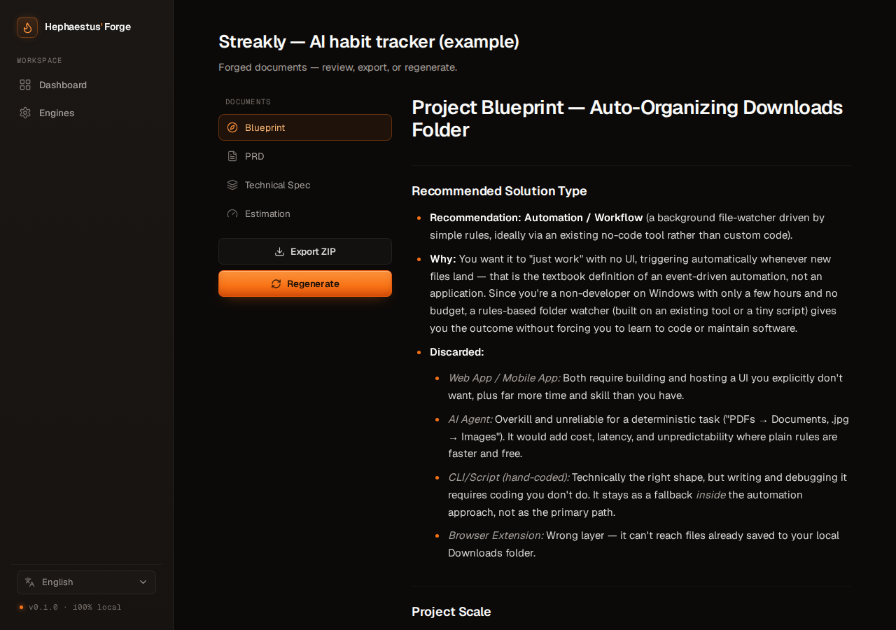
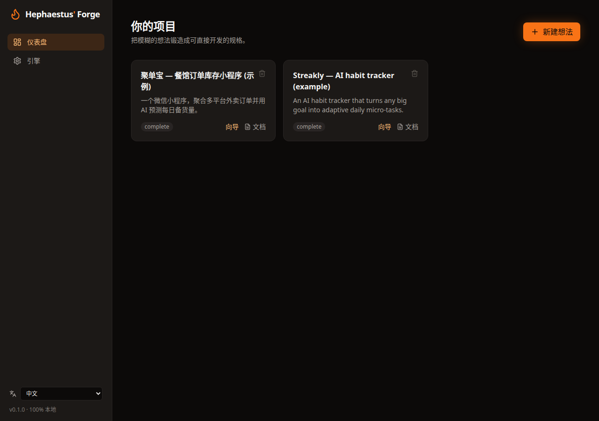

<div align="center">

# 🔥 Hephaestus' Forge

### Forge a vague idea into a build-ready spec — with the AI engine you already have.

**Self-hosted · 100% local · Bring Your Own Engine**

[English](README.md) · [简体中文](README.zh.md) · [Español](README.es.md)

[](https://r10d1nsec.github.io/hephaestus-forge/)
[](https://github.com/r10d1nsec/hephaestus-forge)

[](LICENSE)
[](CONTRIBUTING.md)
[](https://github.com/r10d1nsec/hephaestus-forge/stargazers)
[](https://github.com/r10d1nsec/hephaestus-forge/network/members)
[](https://github.com/r10d1nsec/hephaestus-forge/issues)


🌐 **[Website & demo](https://r10d1nsec.github.io/hephaestus-forge/)** · 📂 **[Examples](examples/README.md)** · 🚀 **[Quickstart](#-quickstart)** · 🤝 **[Contribute](#-join-the-forge)**

<br/>

[](https://r10d1nsec.github.io/hephaestus-forge/)

<sub>From a one-line idea → a 5-phase interview → a build-ready **Project Blueprint**. 100% local, on the AI engine you already have.</sub>

</div>

---

## 💡 The problem

You have an idea. You open Claude Code / Cursor / Codex and start prompting. Three hours later you're
deep in a refactor because the idea was never actually *defined* — wrong scope, wrong stack, maybe
the wrong **kind** of solution entirely (you built an app when a 200-line automation would've done it).

AI coding agents are only as good as the context you give them. **Half-baked ideas produce
half-baked code, wasted tokens, and expensive rewrites.**

## 🔨 The solution

**Hephaestus' Forge** is a self-hosted web app that *interviews you* about your idea through a
focused 5-phase wizard, then forges a complete, build-ready documentation pack you drop straight
into your AI IDE as context:

- 🧭 **Project Blueprint** — recommends the *right kind* of solution (automation / agent / web / app / CLI), the scale, the time, the stages, and the scope.
- 📋 **PRD** — personas, prioritized user stories with acceptance criteria, non-goals, KPIs.
- 🏗️ **Technical Spec** — a justified stack, data model, API surface, deployment strategy.
- ⏱️ **Estimation** — honest min/max ranges with named risk factors, not one optimistic number.

And the part nobody else does: **it runs on the AI you already have.**

## ✨ Why you'll want it

| | |
|---|---|
| 🔒 **Private by default** | 100% self-hosted. Your idea and API keys live in a local SQLite file and **never leave your machine.** No telemetry, no SaaS account. |
| ⚡ **Bring Your Own Engine** | Runs on the coding agents you already have — Claude Code, Codex, Gemini CLI — plus Ollama and any API provider. No vendor lock-in. |
| 🧭 **Picks the right solution** | Stops you from building an app when an automation or agent fits better — *before* you write a line of code. |
| 💸 **Saves tokens & rewrites** | A sharp spec up front means your agent builds the right thing the first time. |
| 🌍 **Multilingual** | Full UI in EN · 中文 · ES · FR · DE — and the language you pick drives the interview questions and the generated documents. |
| 📦 **Drop-in context** | Export a clean Markdown ZIP, ready to paste into any AI IDE. |
| 🆓 **Open source (MIT)** | Free forever. Extend it, fork it, ship it. |

## 👤 Who it's for

- **Vibe coders & indie hackers** turning a spark into something real this weekend.
- **Developers** who want their AI agent to build the right thing the first time.
- **Founders & PMs** who need a credible spec, scope, and estimate to align on.
- **No-code builders** who want to know whether to build an app, an automation, or an agent.
- **Privacy-conscious teams** who can't send their ideas to a third-party SaaS.

## ⚡ Bring Your Own Engine

Every other planning tool locks you into one API key. Hephaestus runs on whatever you've got —
including the coding agents already installed on your machine:

| Engine | Examples | Works in |
|---|---|---|
| 🖥️ **CLI agents** | `claude` (Claude Code), `codex`, `gemini` | Native mode |
| ☁️ **API providers** | Anthropic, OpenAI, Google Gemini, OpenAI-compatible (OpenRouter, Groq, Together…) | Docker + Native |
| 🧊 **Local models** | Ollama (Llama, Mistral, Qwen…) | Docker + Native |

The app **auto-detects** the CLI agents in your `PATH` and lets you configure API/Ollama providers
in a dedicated **Engines** panel — test the connection, pick a default, done. Keys are stored only
in a local SQLite file and are **honest** about state: *detected in PATH ≠ authenticated* — you click
**Test** to verify before using.

## 🛠️ How it works

```
Describe your idea → 5-phase guided wizard → Generate docs → Export ZIP
       💡        Discovery·Audience·Solution-Fit·Scope·Constraints   📦 drop into your AI IDE
```

1. **Describe** your idea in a sentence or a paragraph.
2. **Answer** a short, AI-generated interview — one sharp question at a time, streamed live — across
   five phases: **Discovery → Audience → Solution-Fit → Scope → Constraints**. This is what lets
   Hephaestus recommend the *right kind* of solution instead of assuming you need an app.
3. **Generate** a pack led by a **Project Blueprint**, plus **PRD · Technical Spec · Estimation**.
4. **Export** as a ZIP of clean Markdown, ready as context for your coding agent.

## 📸 See it in action

> 🌐 **Prefer to look first? [Visit the website →](https://r10d1nsec.github.io/hephaestus-forge/)**

| Project Blueprint (solution type · scale · stages) | Multilingual UI (中文) |
|---|---|
|  |  |
| **Bring Your Own Engine** | **Generated document viewer** |
|  |  |

## 📂 Examples (real output)

Three complete packs **generated by Hephaestus itself** with the Claude Code engine — from one
sentence to a full doc set:

- 🤖 [**Standup Forge**](examples/standup/) — git activity → daily standup. Its [Blueprint](examples/standup/blueprint.md) recommends a **scheduled automation, not a web app**.
- 🇬🇧 [**Streakly**](examples/streakly/) — an AI habit tracker → [PRD](examples/streakly/prd.md).
- 🇨🇳 [**聚单宝**](examples/dianxiaoer/) — a restaurant order/inventory mini-program (fully in Chinese).

See [`examples/`](examples/README.md) for the breakdown.

## 🆚 How it compares

| | GTPlanner | DocForge-AI | ideaforge.chat | **Hephaestus' Forge** |
|---|:---:|:---:|:---:|:---:|
| Self-hosted / private | ✅ | ✅ | ❌ (SaaS) | ✅ |
| One-command Docker | ❌ | ❌ | — | ✅ |
| **CLI agents (Claude Code/Codex/Gemini)** | ❌ | ❌ | ❌ | ✅ |
| Local models (Ollama) | ❌ | ❌ | ❌ | ✅ |
| Guided wizard UI | ❌ | ❌ | ✅ | ✅ (5 phases) |
| **Recommends solution type (automation/agent/web/app)** | ❌ | ❌ | ❌ | ✅ |
| Multilingual app (EN/中文/ES/FR/DE) | ❌ | ❌ | ❌ | ✅ |
| Honest time estimation | ❌ | ❌ | ❌ | ✅ |
| Open source (MIT) | ✅ | ✅ | ❌ | ✅ |

## 🚀 Quickstart

### Option A — Docker (API + Ollama engines)

```bash
git clone https://github.com/r10d1nsec/hephaestus-forge
cd hephaestus-forge
cp .env.example .env        # optional — you can also configure engines in the UI
docker compose up -d
# open http://localhost:3000
```

### Option B — Native mode (unlocks CLI agents 🔓)

Runs on the host so it can reach `claude` / `codex` / `gemini` in your `PATH`:

```bash
git clone https://github.com/r10d1nsec/hephaestus-forge
cd hephaestus-forge
./run.sh
# open http://localhost:3000
```

## 📐 Architecture

React + Vite + Tailwind frontend · FastAPI + SQLite backend · a single **Engine abstraction** that
every provider plugs into. Read [docs/ARCHITECTURE.md](docs/ARCHITECTURE.md) and
[docs/ENGINES.md](docs/ENGINES.md).

## 🗺️ Roadmap

- [x] **v0.1 — MVP**: Docker + native, Engines panel, wizard, PRD/Tech Spec/Estimation, ZIP export
- [x] **v0.2**: 5-phase wizard, **Project Blueprint** with solution-type recommendation, multilingual app, premium redesign
- [ ] **v0.3**: User Flows (Mermaid), AI Prompts Pack, inline editor, version history, PDF export
- [ ] **v1.0**: "Copy as Claude context", GitHub Gist export, custom templates, CLI companion, VS Code extension

Have an idea for the roadmap? [Open an issue](https://github.com/r10d1nsec/hephaestus-forge/issues) or start a [discussion](https://github.com/r10d1nsec/hephaestus-forge/discussions).

## 🤝 Join the forge

**Hephaestus is built in the open, and contributors are what make it better.** Whether you write
Rust or you've never opened a terminal, there's a way in:

- ⭐ **Star the repo** — the single biggest, easiest way to help it reach more builders.
- 🖥️ **Add an engine** — the highest-value contribution. Each new engine brings its whole community. There's a hands-on *"add your first engine in ~20 minutes"* walkthrough in [CONTRIBUTING.md](CONTRIBUTING.md).
- 🌍 **Translate** — add a `README.<lang>.md` or a UI locale and reach a new audience.
- 📝 **Improve the prompts** — the wizard and generators are just Markdown in `backend/prompts/`. No code required.
- 🐛 **Report a bug** or 💡 **suggest a feature** — [open an issue](https://github.com/r10d1nsec/hephaestus-forge/issues).
- 🧪 **Share what you forged** — post a generated pack in [Discussions](https://github.com/r10d1nsec/hephaestus-forge/discussions).

New here? Look for [`good first issue`](https://github.com/r10d1nsec/hephaestus-forge/labels/good%20first%20issue) — we keep a [seed list](docs/GOOD_FIRST_ISSUES.md) of scoped, friendly starters. Be kind; see the [Code of Conduct](CODE_OF_CONDUCT.md).

> Every star, issue, and PR genuinely moves this forward. Thank you for forging with us. 🔥

## 📜 License

[MIT](LICENSE) © 2026 Angel Roldan — Córdoba, Spain.

<div align="center">
<br/>

### If Hephaestus saved you a refactor, give it a ⭐

[](https://github.com/r10d1nsec/hephaestus-forge)
[](https://r10d1nsec.github.io/hephaestus-forge/)

</div>
